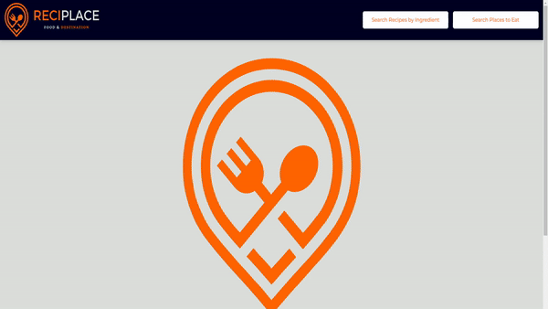

# RECIPLACE

## Description

This is a website where users can search for recipes and view restuarant locations for inspiration. It includes building a

## Deployment Link

https://cinosmagician.github.io/group-2-recipe-project/

### User Story

As someone who is looking for a meal  
I WANT to be presented with inspiring recipe options  
OR restaurants to eat at  
SO THAT I can either cook the recipe  
OR eat at a recommended restaurant to satiate my hunger

## Acceptance Criteria

GIVEN a web application  
WHEN I search an ingredient  
THEN I am presented with a form  
WHEN I enter my preferences  
THEN I am presented with a carousel of recipes  
WHEN I am presented with a recipe  
THEN I am also presented with an image of the meal, an ingredient list as well as the method  
WHEN I search for a place to eat and complete the form  
THEN a list of restaurants are displayed as buttons  
WHEN I click on a restaurant button  
THEN the details of the restaurant are displayed (name, address, status, rating)  
WHEN I click the favourite button for either recipe or restaurant  
THEN the information is stored client side

## File Structure

> Group-2-Recipe-Project
>
> > assets
> >
> > - styles.css
> >   favicon
> >   js
> > - script.js
> >   logo
> > - reciplace logo img icon 500 x 500
>
> - index.html
> - README.md

## Usage

### Webpage Demo

### Website Features

- HTML
- CSS
- Bulma CSS - The Modern CSS Framework
- JavaScript
- Modal Forms
- Font Awesome
- Favicon
- Canva
- Image Logo

#### API

- The Meal DB
- Google Places

### Technical Details

Background Colour - #DBDFDB
Font Type - "Montserrat", sans-serif, Serif;
Font colours - #000023 & #FE6400
Modal Forms

## Credits

### TEAM COLLABORATORS

> Rhianna Wilson  
> Lachlan Huges  
> Mimi Nguyen

## License

N/A
